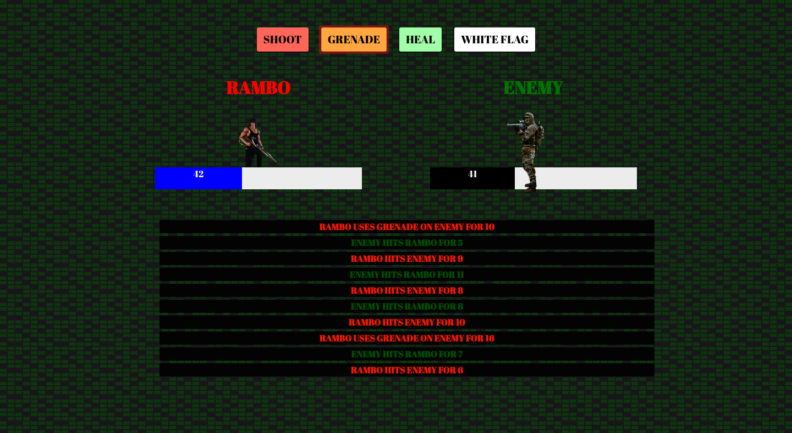

# vue-js-lock-n-load
Rambo mini-game built with Vue.js

**You can play the game by going to this [link](http://debonair-pear.surge.sh/) or you can clone and run on your local server with live-server or your server of choice.

